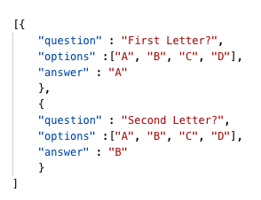

# jQuery Quiz Template
A quiz template using jQuery, Javascript, JSON, CSS, and HTML

## How To Use
This project is a starting point for anyone that wants to make a responive quiz. 

### Put your questions in the data file

Replace the dummy data in the **data.json** file with your questions and answers.

1. Put your first question in the 'question' property in double quotes.
2. Put your multiple choice answers in the 'options' property, each in double quotes separted by commas within the square brackets.
3. Put the correct answer in the "answer" property in double quotes. It must match one of the options exactly.
4. Add another question by repeating steps 1-3. Each question object should be within curly brackets, separated by a comma. The entire set of questions ahould be within square brackets.

### A note about jQuery
This project links to a jQuery cdn. This means it will not work offline because it needs access to the web to reach this cdn. If you need it to work offline locally on your computer, go [here](https://jquery.com/download/) to download a jQuery library file. Put the file in your directory and link to it in the head section. For more info on linking to jQuery go [here](https://www.w3schools.com/jquery/jquery_get_started.asp).

### CSS
This project uses minimal internal CSS (css located in the head section). You can externally link to your own css file to further style this project or add more styles to the internal CSS.

